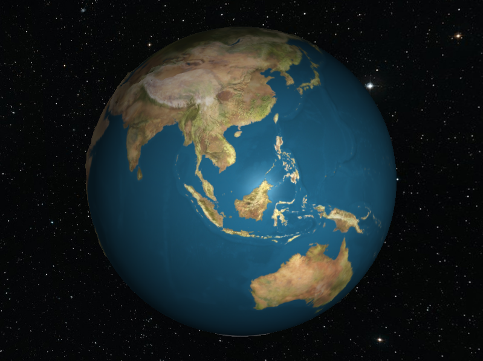
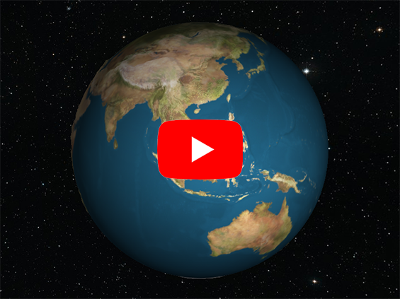

# Planet Earth using Cubesphere in OpenGL

## Summary
&nbsp;&nbsp;&nbsp;&nbsp;The goal of this project is to create realistic 3D model of planet Earth. 
  * First, it was necessary to create Cubesphere mesh.
  * Secondly, main texture and bump map was applied.
  * Thirdly, Phong shading was used for lightning and stars skybox for background.
  * Finally, camera movement and zoom was added.

